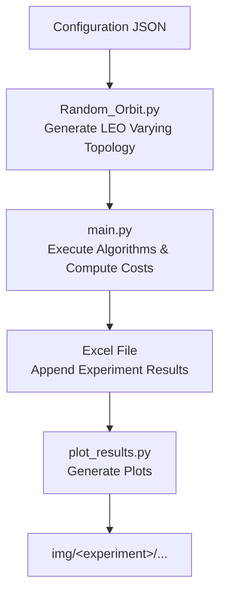

# ⭐ Dynamic Multicast Evaluation Platform for LEO Satellite Networks  
### *A Modular, Reproducible Simulation Framework*

## 1. Overview

This project provides a dynamic evaluation platform for multicast strategies in LEO (Low Earth Orbit) satellite networks.

### Key Features
- Realistic LEO constellation generation (Walker-Delta model)
- Multi-time-slot dynamic topology
- Support for multiple multicast algorithms
- Automatic cost measurement: **BC / CC / RC / Total**
- Automatic Excel logging
- Automatic curve plotting
- Batch experiment support

## 2. System Architecture



## 3. Folder Structure

```
Graph/
│
├── configs/
│   ├── realistic_100sats.json
│   └── realistic_600sats.json
│
├── output_graphs/
│   ├── graph_1_t0.txt
│   ├── graph_1_t1.txt
│   └── ...
│
├── starlink_exp.xlsx
│
├── img/
│   └── starlink_exp/
│       ├── BC/
│       │   └── starlink_exp_BC.png
│       ├── CC/
│       │   └── starlink_exp_CC.png
│       ├── RC/
│       │   └── starlink_exp_RC.png
│       └── Total/
│           └── starlink_exp_Total.png
│
├── Random_Orbit.py
├── main.py
├── plot_results.py
└── run.sh
```

---

## 4. Configuration Example

```json
{
    "n_sats": 100,
    "n_clouds": 30,
    "n_srcs": 1,
    "n_dests": 100,
    "total_time": 10,

    "num_planes": 6,
    "altitude_km": 550.0,
    "inclination_deg": 53.0,
    "base_angular_velocity": 0.06,

    "thr_cloud_to_cloud": 3000.0,
    "region_dist_thr": 1000.0,

    "seed_offset": 1
}
```

---

## 5. Running Experiments

### 5.1 Generate LEO Dynamic Topology
```bash
python Random_Orbit.py configs/realistic_100sats.json
```

### 5.2 Run Multicast Algorithms
```bash
python main.py configs/realistic_100sats.json
```

### 5.3 Batch Experiments (N runs)
```bash
./run.sh 50 configs/realistic_100sats.json
```

---

## 6. Excel Output Format

Each graph instance generates **3 rows** (one per algorithm):

| experiment_id | timestamp | graph    | algo  | BC | CC | RC | Total |
|---------------|-----------|----------|-------|----|----|----|--------|
| 1             | …         | graph_1  | DMTS  | …  | …  | …  | …      |
| 2             | …         | graph_1  | OffPA | …  | …  | …  | …      |
| 3             | …         | graph_1  | TSMTA | …  | …  | …  | …      |

The spreadsheet grows as new runs are appended.

---

## 7. Plot Generation

### Run:
```bash
python plot_results.py starlink_exp.xlsx
```

### Output:
- Total cost curve  
- BC curve  
- CC curve  
- RC curve  

Each curve includes:
- DMTS  
- OffPA  
- TSMTA  

### File Structure
```
img/<excel_name>/<metric>/<excel_name>_<metric>.png
```

Example:
```
img/starlink_exp/Total/starlink_exp_Total.png
```

---

## 8. Connectivity Guarantee

Dynamic LEO topologies may disconnect.  
To ensure algorithms can execute:

- Detect disconnected components  
- Auto-add minimal **lifeline edges**  
- Preserve region/grouping  
- Insert edges with:
  - latency = **1**
  - bandwidth = **1000**
  - **bidirectional**

This guarantees fully usable graphs.

---

## 9. Engineering Contributions

- Modular topology generator  
- Reproducible experiment seeds  
- Unified evaluation pipeline  
- Automatic Excel logging  
- Automatic plotting  
- Batch automation with `run.sh`  
- Realistic latency & elevation modeling  